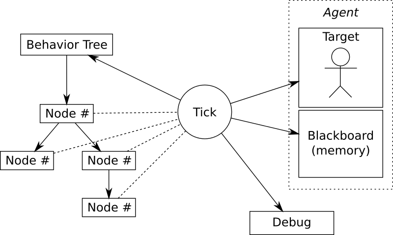

基于Erlang的行为树实现
====

什么是行为树
----
行为树，英文是Behavior Tree，简称BT，是由行为节点组成的树状结构。行为树的每个节点都会返回一个状态，成功，失败，运行，父节点根据子节点的返回值做出相应的决策。
在游戏开发中，行为树主要用来实现怪物AI的行为决策，根据条件以及环境来决定怪物执行什么样的行为，如攻击，逃跑，巡逻，休息等。

为什么使用行为树
----
怪物行为的控制一般来说有三种方法，
* 最简单的if-else嵌套。这种方法最直观，但是维护起来比较困难。
* 第二种方法是有限状态机。根据怪物当前所处的状态和当前的环境，决定状态如何迁移。当状态较多时，状态之间的迁移会比较复杂。而且增加状态时需要改动的地方很多。
* 行为树相对于前两种方式的优势在于，他实现了控制逻辑与行为逻辑的分离，控制逻辑就是行为树，行为逻辑则是各个行为节点。
对于游戏开发来说，我们可以让策划通过行为树编辑器来编辑行为树，程序只需要实现具体的行为节点，就可以实现行为决策。

组成部分
----
行为树的结构如图。



行为树有四种类型的节点，分别是
* 控制节点，最主要的是选择节点（Selector）和顺序节点（Sequence）。控制节点都不是叶子节点，它根据子节点的返回值返回成功，失败，运行这三种状态。
* 行为节点，具体的行为逻辑，如逃跑，巡逻。行为节点一般是叶子节点，返回成功，失败，运行这三种状态。
* 条件节点，叶子节点，返回成功，失败这两种状态。
* 装饰节点，非叶子节点，实现一些附加的逻辑。如取反。

黑板（blackboard）是行为树实现中用来存储变量，感知环境的一个概念，节点可以访问黑板来存取变量。

行为树一般以一定的频率周期性的执行tick函数，每次tick都从根节点开始执行。有一些行为树会直接从返回运行的节点开始执行，这样的话如果有低优先级的节点一直返回运行状态，
遇到高优先级的节点时则无法打断低优先级的节点。比如怪物在巡逻的时候返回运行，这时候如果有玩家攻击它，合理的反应是进行反击或者逃跑，但是如果每次tick都从巡逻节点开始执行，
则根本不会处理到反击或逃跑的逻辑。

要注意的一个问题是，当出现高优先级的行为B1打断低优先级行为B2时，因为每次从根节点开始tick，B2的无法从内部正常的关闭。这时候需要在主逻辑上额外处理一下上上次打开的节点，
即调用一下这些节点的close函数。Behavior3的实现中通过比较本次的开放节点列表和上次的开放节点列表，找出上次开放，本次没有开放的节点来关闭，这样可能存在一个问题。
也就是当上次开放的节点在本次tick正常结束的情况下，仍然会被重新关闭一次，即一个节点关闭了两次。解决的办法是，在判断节点是否需要关闭的时候，检测一下节点是否开放，
如果是开放，则关闭，否则不予处理。Erlang版本的实现中通过遍历行为树节点来找到未正常关闭的节点，考虑到行为树通常不会很大，性能上也可以接受。


具体实现
----
Erlang版行为树的具体实现参考了Behavior3的版本。每个节点的执行逻辑:
``` -erlang
execute(#node{id = Id} = Node, #tick{blackboard = Blackboard} = Tick) ->
    Tick1 = enter_cb(Node, Tick),
    Tick2 = case get_key({is_open, Id}, Blackboard, false) of 
        false -> open_cb(Node, Tick1);
        true -> Tick1
    end,
    {Status, Tick3} = tick_cb(Node, Tick2),
    Tick4 = case Status of 
        running -> Tick3;
        _ -> close_cb(Node, Tick3)
    end,
    Tick5 = exit_cb(Node, Tick4),
    {Status, Tick5}. 
```

选择节点

```
priority([], Tick) ->
    {false, Tick};
priority([C|Children], Tick) ->
    case execute(C, Tick) of
        {true, NewTick} -> 
            {true, NewTick};
        {running, NewTick} ->
            {running, NewTick};
        {false, NewTick} ->
            priority(Children, NewTick)
    end.
```

顺序节点

```
priority([], Tick) ->
    {false, Tick};
priority([C|Children], Tick) ->
    case execute(C, Tick) of
        {true, NewTick} -> 
            {true, NewTick};
        {running, NewTick} ->
            {running, NewTick};
        {false, NewTick} ->
            priority(Children, NewTick)
    end.
```

遍历行为树关闭未能正常关闭的节点

```
close_nodes(_, _, [], Tick) -> Tick;
close_nodes(undefined, _, _, Tick) -> Tick;
close_nodes(#node{children = [], child = undefined} = Node, CurOpenNodes, LastOpenNodes, Tick) ->
    close_node(Node, CurOpenNodes, LastOpenNodes, Tick);
close_nodes(#node{children = Children, child = undefined} = Node, CurOpenNodes, LastOpenNodes, Tick) ->
    NewTick = close_node(Node, CurOpenNodes, LastOpenNodes, Tick),
    lists:foldl(
        fun(Child, Acc) ->
            close_nodes(Child, CurOpenNodes, LastOpenNodes, Acc)
        end,
        NewTick,
        Children
    );
close_nodes(#node{children = [], child = Child} = Node, CurOpenNodes, LastOpenNodes, Tick) ->
    NewTick = close_node(Node, CurOpenNodes, LastOpenNodes, Tick),
    close_nodes(Child, CurOpenNodes, LastOpenNodes, NewTick).
close_node(#node{id = Id} = Node, CurOpenNodes, LastOpenNodes, #tick{blackboard = Blackboard} = Tick) ->
    case lists:member(Id, LastOpenNodes) andalso 
         not lists:member(Id, CurOpenNodes) andalso 
         get_key({is_open, Id}, Blackboard, false) of
        true -> 
            %%?DEBUG("close_node ~p", [Node]),
            close_cb_(Node, Tick#tick{blackboard = dict:store({is_open, Id}, false, Blackboard)});
        false -> 
            Tick
    end.
```

参考文档
----
* [An Introduction to Behavior Tree - Part 1](http://guineashots.com/2014/07/25/an-introduction-to-behavior-trees-part-1/)
* [An Introduction to Behavior Tree - Part 1](http://guineashots.com/2014/08/10/an-introduction-to-behavior-trees-part-2/)
* [An Introduction to Behavior Tree - Part 3](http://guineashots.com/2014/08/15/an-introduction-to-behavior-trees-part-3/)
* [Implementing A Behavior Tree – Part 1](http://blog.renatopp.com/2014/09/24/implementing-a-behavior-tree-part-1/)
* [Implementing A Behavior Tree – Part 2](http://guineashots.com/2014/10/25/implementing-a-behavior-tree-part-2/)
* [参考源码](https://github.com/wudeng/behavior_tree/)
