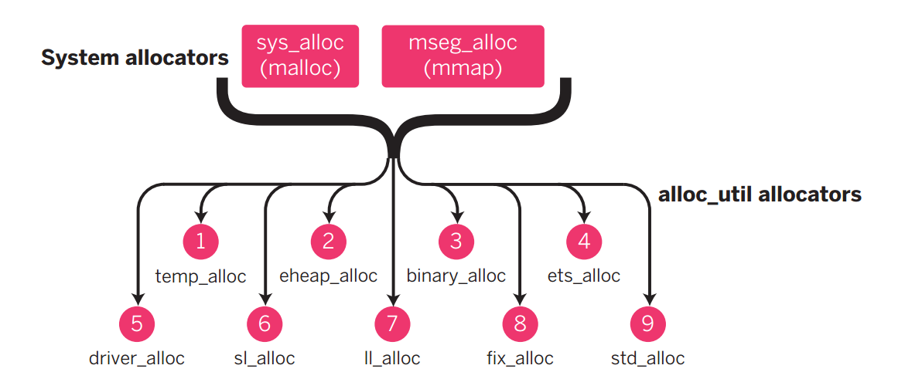

Erlang Memory Management
====

系统自带的分配器存在的缺点：
* 小内存分配效率低。
* 所有数据同样的分配策略，增加碎片。
* 缺乏跨平台细粒度的统计
* `+Mea` disable erts allocators and use malloc for everything
* 多核内存管理更加重要也更加复杂

概念
----

* Block: 虚拟机请求的一块内存区域。
* Carrier: 包含一个或多个Block的内存区域，分为sbc，mbc。正常情况下大部分数据位于mbc。
    * Single Block Carrier sbc
        * 大的block进入sbc
        * `+M<S>sbct` 默认512k
        * 可以通过erlang:system_info(allocator)查看各个allocator的配置参数
    * Multiblock Carrier mbc
        * `+M<S>smbcs` smallest Multiblock carrier size
        * `+M<S>lmbcs` largest multiblock Carrier size
        * `+M<S>mbcgs` multiblock Carrier grow stage
        * 如果增加sbct一般也会相应增大smbcs和lmbcs
    * 通过mseg_alloc分配的mbc的大小
        * smbcs+nc*(lmbcs-smbcs)/mbcgs (nc <= mbcgs) 
        * lmbcs (nc > mbcgs)
    * 通过sys_alloc分配的mbc
        * least number of multiple of ycs satisfying the request

各种分配器
----

文件erl_alloc.types中列举了所有的分配器类型以及不同数据对应的分配器类型。
ERTS中一共定义了11中不同的分配器，包括最基本的sys_alloc以及mseg_alloc。
详情见下表。Flag是启动ERTS时修改分配器配置参数的标志。

| Name                     | Description           | C-name       | Type-name   | Flag |
|--------------------------|-----------------------|--------------|-------------|------|
| Basic allocator          | malloc interface      | sys_alloc    | SYSTEM      | Y    |
| Memory segment allocator | mmap interface        | mseg_alloc   | -           | M    |
| Temporary allocator      | Temporary allocations | temp_alloc   | TEMPORARY   | T    |
| Heap allocator           | Erlang heap data      | eheap_alloc  | EHEAP       | H    |
| Binary allocator         | Binary data           | binary_alloc | BINARY      | B    |
| ETS allocator            | ETS data              | ets_alloc    | ETS         | E    |
| Driver allocator         | Driver data           | driver_alloc | DRIVER      | R    |
| Short lived allocator    | Short lived memory    | sl_alloc     | SHORT_LIVED | S    |
| Long lived allocator     | Long lived memory     | ll_alloc     | LONG_LIVED  | L    |
| Fiexed allocator         | Fiexed size data      | fix_alloc    | FIXED_SIZE  | F    |
| Standard allocator       | For most other data   | std_alloc    | STANDARD    | D    |

* eheap，binary, driver, ets
* temporary 
    * c function scope
    * temp gc rootset
    * dist msg decode
* short lived 
    * ets match specs 
    * short timers 
    * fd select list
* standard lived
    * links
    * monitors
* long lived
    * code
    * atoms
* fix size 
    * process control block
    * port control block

分配策略(as)
----
allocation strategy，从mbc中找到空闲block的策略。
* Block Oriented
    * best fit: 找到满足要求的最小block，二叉平衡树，logN
    * address order best fit
    * address order first fit
    * good fit
    * a fit
* Carrier Oriented
    * address order first fit carrier best fit 
    * address order first fit carrier address order best fit

Carrier分配器
* mseg alloc
    * /dev/zero mmap, munmap, mremap
    * cache freeed carries
* sys alloc
    * maps to malloc, free
    * multiple of +Muycs to help avoid fragmentation
    * used for main carrier allocaton
    
统计
----
erlang:system_info(allocator)
* sys_alloc mseg_alloc
* eheap_alloc, ets_alloc, binary_alloc, driver_alloc
* temp_alloc, sl_alloc, std_alloc, ll_alloc, fix_alloc

erlang:system_info({allocator, Type})

主要配置参数
----
* sbct
* mbc allocation strategy

实例
----

问题一: large binary

- 现象：性能低下，通过strace发现malloc比mmap多得多。
- 原因： 统计发现sbcs carrier_size 比 mbcs carrier_size大得多，大量binary放到了sbc。
- 解决方案： 
    - 增大`+MBsbct`, 同时增大`+MBlmbcs`和`+MBsmbcs`

问题二：碎片问题

这是lyse作者在实际项目中遇到的问题，详情见作者博客[logplex down the rabbit hole](https://blog.heroku.com/logplex-down-the-rabbit-hole)。
- 现象：
    - erlang:memory(total) 7GB
    - top 显示 15GB
    - 崩溃日志：ets_alloc: Cannot allocate XYZ bytes of memory. Abnormal termination
- 原因： Carrier中残留的block导致Carrier无法回收
- 方案：减少碎片
    - `+MBas aobf` address order best fit 更集中
    - 减小`+MBlmbcs` 来分配更多的小mbc，更容易被回收

参考文档
----

* Memory Management Battle Stories by lukas larsson
* http://erlang.org/doc/man/erts_alloc.html
* [logplex down the rabbit hole](https://blog.heroku.com/logplex-down-the-rabbit-hole)
* The beam book
