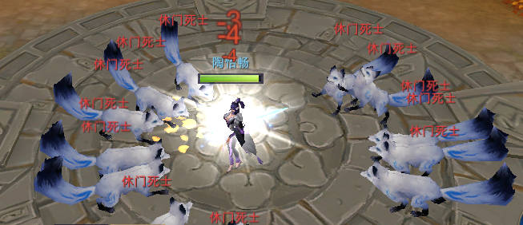

怪物包围算法
====

ARPG游戏中经常出现多个怪物追着玩家跑的情况，如果怪物始终瞄着玩家的位置移动，那么很容易就出现怪物扎堆的情况。
本文探讨并实现了一个位置管理算法，来解决这个问题。

算法思路
----
我们的思路是：如果玩家已经在攻击范围内，直接攻击。否则怪物向玩家移动，形成一个以攻击距离为半径，玩家为圆心的包围圈。
在移动过程中，怪物优先选择怪物所在位置与玩家连线跟圆的交点。 如果交点被占据，则向两边搜索新的位置，直到找到一个位置为止。

具体实现
----
整个圆是360度，我们把它等分为18个区间，每个区间20度，18个区间基本足以满足对怪物数量的要求了。
我们首先找到怪物相对玩家位置的角度。

`CurAngle = (math:atan2(Z1 - Z0, X1 - X0) / math:pi()) + 180`

atan2求出的范围是弧度(-pi, pi]，我们需要将其转换为(0, 360]的角度。
然后检查是否当前角度所在的区间是否已经被占用，由于区间是一个连续的范围，我们用起点来表示一个区间。

```
-define(SLICE, 20). %% 极坐标20度为一个slot分布怪物

find_angle(PlayerId, PlayerPos, Angle) ->
    PlayerPos0 = get({player_pos, PlayerId}),
    PlayerPos0 /= PlayerPos andalso 
    begin 
        erase({angle, PlayerId}),
        put({player_pos, PlayerId}, PlayerPos),
        ?INFO("~p change pos ~p", [PlayerId, PlayerPos])
    end,
    AdjustAngle = (Angle div ?SLICE) * ?SLICE,
    Angles = occupied_angle(PlayerId),
    TheAngle = 
    case lists:member(AdjustAngle, Angles) of
        true ->
            find_angle1(AdjustAngle, ?SLICE, Angles);
        false ->
            AdjustAngle
    end,
    put({angle, PlayerId}, [TheAngle|Angles]),
    lib_common:random_n(TheAngle, TheAngle + ?SLICE - 1) rem 360.
    
occupied_angle(PlayerId) ->
    case get({angle, PlayerId}) of
        undefined -> [];
        List -> List
    end.

```

如果当前区间已经被占用，则向两边搜索可用的区间。
我们维护一个Delta差值，逐步增大Delta，向外扩张来搜索新的区间，直到找到为止。之所以限制Delta的范围是不想让怪物越过玩家，
所以如果所有怪都是从同一个方向向玩家移动的时候会形成一个接近半圆的包围圈。

```
find_angle1(AdjustAngle, Delta, _Angles) when Delta > 100 ->
    AdjustAngle;
find_angle1(AdjustAngle, Delta, Angles) ->
    Angle1 = (AdjustAngle + Delta) rem 360,
    case lists:member(Angle1, Angles) of
        true -> 
            Angle2 = (AdjustAngle - Delta + 360) rem 360,
            case lists:member(Angle2, Angles) of
                true ->
                    find_angle1(AdjustAngle, Delta+?SLICE, Angles);
                false ->
                    Angle2
            end;
        false ->
            Angle1
    end.
```

解决了怪物分布的问题，还有一个问题就是玩家位置的维护。因为玩家是一直移动的，而且移动的频率很高。
如果每次玩家移动了以后，都清除掉老的区间，重新计算新的区间。代价会比较大，而且也不是很有必要。
所以我们只会在玩家离开一段距离导致目标点无法攻击玩家的时候，才更新圆心的位置，所以实际上圆心的位置跟玩家的位置可能存在一定的偏移，
这一点我们是可以容忍的。

```
TargetPos = if 
    TP =:= undefined -> 
        get_target_pos(PlayerId, MonsterId, PlayerPos, Distance);
    true -> 
        %% 玩家离开一段距离了，导致目标点无法攻击玩家，则更新目标点
        Dis2 = lib_map_util:calc_dis2(TP, PlayerPos),
        if 
            Dis2 =< Distance * Distance + ?EPSILON2 -> TP;
            true -> get_target_pos(PlayerId, MonsterId, PlayerPos, Distance) 
        end
end
```

TP是老的怪物目标点，如果我们发现怪物的目标点无法攻击到玩家，则更新目标点。这里比较距离的时候还有个坑，
浮点数的精度有限，所以我们需要加入一个误差，`EPSILON2`。否则计算出来的目标点有可能会无法满足不等式而导致怪物在玩家周围做小步调整来切换目标点。

## 效果图


