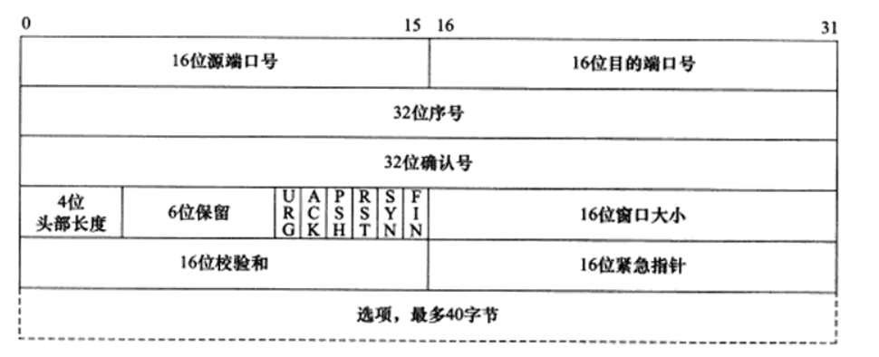
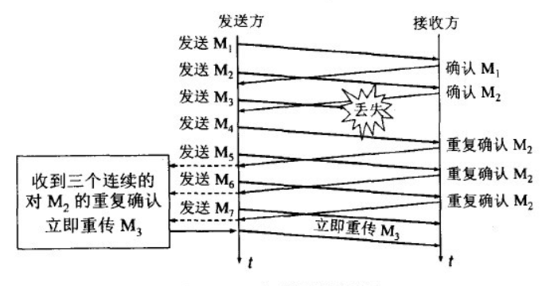
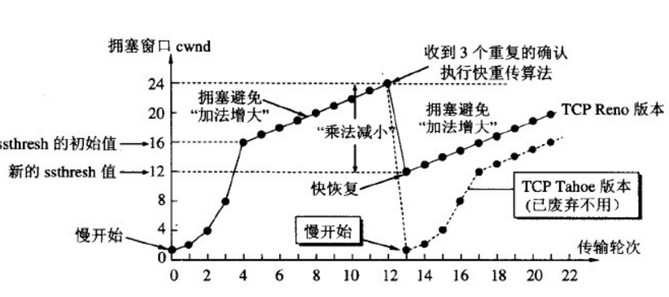
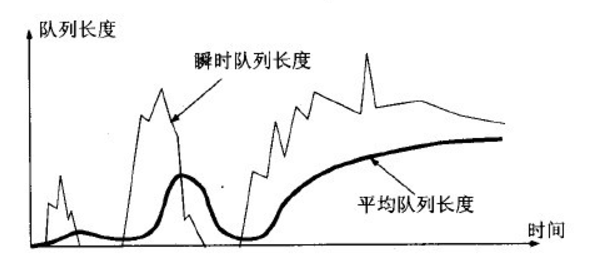

# TCP那些事儿

* 面向连接，一对一，所以基于广播和多播的应用程序不能使用TCP服务。而无连接的UDP则非常适合广播和多播。
* 字节流，TCP 字节流，send()写recv()读次数没有固定关系，UDP 数据报，sendto()写recvfrom()读次数相同。
* 可靠传输。

传输层-Segment, 网络层-Packet, 链路层-Frame

## TCP HEADER



* 32位序号sequence number, ISN + byte offset of the first byte in the packet
    - ISN initial sequence number, random generated
* 4 bit header length: unit 32bit
    - min = 4 * 5 = 20
    - max = 4 * 15 = 60
* Flags
    - URG
    - ACK
    - PSH
    - RST
    - SYN
    - FIN
* RWND receiver window
* checksum crc(header + data)
* options <= 40 byte


* kind 1, length 1, info n
* kind:
    - 0 terminate
    - 1 nop
    - 2 MSS(Max Segment Size), 以太网MTU为1500字节，减去TCP、IP头部40字节，MSS还剩1460字节。
    - 3 window scale, 0~14, /proc/sys/net/ipv4/tcp_window_scaling only for syn, rfc1323
    - 4 sack-permitted only in syn, /proc/sys/net/ipv4/tcp_sack
    - 5 sack content
    - 8 timestamp for rtt calculation /proc/sys/net/ipv4/tcp_timestamps

### sack （tcp selective acknowledgments）

选择性确认，可通过 `/proc/sys/net/ipv4/tcp_sack` 配置开关。Linux 2.4以后默认打开，不过需要两边都打开才能生效。
发生丢包以后，发送端要么重传所有从丢包的包以后的所有包，要么发送丢失的包以后再等待一个RTT时间来发现下一个要传的包。
选择确认机制就是为了解决这个问题。接收端可以告诉发送端哪些包收到了，发送端只需要发送未收到的包即可。提高了效率。

## TCP 状态转移


主动断开连接的一方，在连接关闭以后进入TIME_WAIT状态, 需要等待2*MSL(Maximum Segment Life) 报文段最大生存时间，rfc1122建议2min。
TIME_WAIT存在的原因：

* 可靠的终止TCP连接。
* 保证让迟来的TCP报文段有足够的时间被识别并丢弃。

服务器主动关闭连接后，监听的端口处于TIME_WAIT状态导致它不能立即重启，需要设置socket选项SO_REUSEADDR来强制进程立即使用处于TIME_WAIT状态占用的端口。
正常终止连接需要四步握手。TCP还提供了异常终止连接的办法，即给对方发送一个复位报文段。一旦发送了复位报文段，发送端素有排队等待发送的数据都将被丢弃。
应用程序可以使用socket选项SO_LINGER来发送复位报文段，以异常终止一个连接。

## TCP 流控

发送方如果发送太快导致接收端来不及接收就会导致丢包。流量控制就是让发送方发送速率不要太快，要让接收方来得及接收。
TCP使用滑动窗口机制来实现对发送方的流量控制。
* 滑动窗口 Sliding Window
    接收端向发送端通告自己的接收窗口rwnd大小，表示接收方能够接收的字节数。
    发送端维护一个发送窗口swnd，保存已发送且尚未收到ack的包。发送窗口不大于接收方的rwnd。
    当接收窗口为0的时候，发送端需要设置持续计时器，persistence timer, 触发发送ZWP(Zero Window Probe)探测包接收端的接收窗口大小（Zero Window Probe Ack）。
        wireshark中使用tcp.analysis.zero_window过滤包，然后后右键follow TCP stream
    有等待的地方就会可能出现DDos攻击，Zero Window也不例外，一种可能的攻击方式：
        攻击者跟服务器建立连接后发送GET请求，然后将窗口设置为0，服务端只能等待进行ZWP，攻击者并发大量这样的请求，把服务器资源耗尽(sockstress)。
    一半会探测3次，每次30-60秒，如果3次过后还是0，有的TCP就会发RST把链接断开。
    发送方的发送数据可以分为：
        - 已经收到ack确认的数据
        - 已经发送但是未收到ack确认的数据
        - 可以发送的数据（接收方还有空间）
        - 不能发送的数据（接收方没有空间）
    中间两者加起来就是发送窗口。
* Nagle算法(TCP_NODELAY) RFC896 (Congestion Control in IP/TCP internetworks)
    - if there are unacknowledged in-flight data, new data is buffered
    - if the data to be send is < MSS, it is buffered until MSS
    When to send data (rfc 1122)
        - Immediately if a full MSS size package can be sent (at least MSS data is accumulated)
        - All previously sent data has been acknowledged AND ((PSH flag is set) OR buffered data > 1/2 * send window)
        - PSH flag is set AND the override timeout(0.1 ... 1s) expired
    针对小包应用的优化。发送方发包的时机，发送方收到对方上一个包的确认后才发送下一个包。确认快那么发送也快，确认慢则发送慢，
    可以根据网速动态调整速率。网速慢时可以显著减少网络上报文的数量。对于实时性要求高的应用如telnet，ssh，mmoarpg，应该要关闭Nagle算法。
    糊涂窗口综合征 Silly Window Syndrom
        接收窗口已满，而交互式应用一次只从接收缓存中读取一个字节，然后向发送方发送确认，并把窗口设置成1个字节。如此往复，网络效率低。
        解决的办法是避免对小的window size做出响应，知道有足够大的window size再响应：
        接收方：David D Clark's方案，等到缓存有足够的空间容纳一个MSS，或者接收缓存已有一半空闲空间的时候才想发送端回确认报文。
        发送端：Nagle's algorithm 不要发送太小的报文，而是把数据报累积成足够大的报文段，或者达到接收方缓存空间一半大小。
    Nagle + Delay ack 导致延迟
        ACK is delayed until return data is available(piggy-backing of ack) or until delayed ack timer expires


## 超时重传RTO（Retransmission timeout）

RTO计算方法见[Computing TCP's Retransmission Timer](https://tools.ietf.org/rfc/rfc6298.txt)，主要维护两个变量：
* SRTT: smoothed round-trip time
* RTTVAR: round-trip time variation

计算过程如下：
- 初始化先设置：
```
RTO = 1 or 3 seconds;
```

- 报文超时，重传以后设置改报文新的超时时间为：
```
RTO = RTO * 2 (back off the timer)
```

- 更新srtt和rttvar之后，计算新的rro：
```
RTO = SRTT + max(G, K*TRRVAR);
RTO < 1 then RTO = 1;
RTO > 60 then RTO = 60;
```

srtt和rttvar的计算过程如下：

- 收到第一个ACK以后，设置：

```
SRTT = R;
RTTVAR = R / 2;
```

- 收到后续的ACK，依次设置：
```
RTTVAR = (1 - bata) * RTTVAR + bata * |SRTT - R'|;
SRTT = (1 - alpha) * SRTT + alpha * R';
```
其中
```
alpha = 1/8, beta = 1/4
```

不能用重传的包来计算rtt, 因为无法确定包是哪个时间点发出的，除非包本身有timestamp。

## 拥塞控制算法 congestion control algorithm

最大化网络上瓶颈链路的带宽。提高网络利用率，降低丢包率，保证公平性。RFC5681
* 慢启动和拥塞避免 slow start and congestion avoidance
* 快速重传和快速恢复 fast retransmit / fast recovery

Linux下课通过sysctl查看使用的拥塞算法，

$ sysctl -a | grep congestion_control
net.ipv4.tcp_congestion_control = cubic
net.ipv4.tcp_available_congestion_control = cubic reno
net.ipv4.tcp_allowed_congestion_control = cubic reno

通过 /proc/sys/net/ipv4/tcp_congestion_control 可以控制使用的拥塞算法。

主要的实现算法有:
* loss based congestion control (bufferbloat problem)
    * reno
    * vegas
    * cubic 看了下centos下都是cubic
* bbr (Bottleneck Bandwidth and RTT)google最新推出的

if CWND < ssthresh
slow start cwnd每个rtt扩大一倍，指数扩大
* IW
* CWND += min(N, SMSS)

if CWND > ssthresh
* CWND += SMSS*SMSS/CWND cwnd每个rtt加1

早期拥塞避免阶段的cwnd计算公式为：`cwnd += (MSS * MSS / cwnd) + MSS/8`，
rfc2525指出了Extra additive constant in congestion avoidance，带来的问题，
即公式后面多余的部分会导致一个RTT内多个包丢失而无法通过快速重传恢复，从而导致超时重传，从而降低性能。
正确的做法应该是去掉后面的部分：`cwnd += (MSS * MSS / cwnd)`。

如果CWND=ssthresh，慢启动或者拥塞避免随意。

发送端判断拥塞：
* 传输超时，tcp重传定时器溢出：慢启动和拥塞避免
    * ssthresh = max(FlightSize/2, 2*MSS)
    * CWND <= SMSS
    * 再次进入慢启动


* 接收到重复的确认报文：快速重传，快速恢复
    * 接收端收到失序报文立即发送重复确认，而不必等待自己发送数据时捎带确认
    * 发送端收到前两个重复确认时，在允许的情况下应该发送一个之前尚未发送的数据包，(FlightSize <= cwnd+2*MSS), CWND保持不变。
    * 发送端收到3个重复确认报文立即重发对方未收到的报文，而不必等待超时。
    ssthresh=max(FlightSize/2, 2*MSS), CWND = ssthresh + 3*MSS，加3是因为收到了3个重复ack报文，意味着有三个报文离开了网络。
    * 每收到一个重复确认：CWND = CWND + SMSS，每收到一个重复确认，那么有一个报文离开了网络。
    * 收到新数据确认：CWND = ssthresh
    * 快速重传和快速恢复完成之后，恢复到拥塞避免阶段




### BBR

传统的拥塞控制算法存在两个问题：
* 无法区分丢包类型，错误丢包和拥塞丢包
* 缓冲膨胀区问题
    * 增加网络延时
    * 缓冲区被填满而丢包
google新出的拥塞控制算法。
* 既然不容易区分拥塞丢包和错误丢包，TCP BBR 就干脆不考虑丢包。
* 既然灌满水管的方式容易造成缓冲区膨胀，TCP BBR 就分别估计带宽和延迟，而不是直接估计水管的容积。

* 在有一定丢包率的网络链路上充分利用带宽。
* 降低网络链路上的buffer占用率，从而降低延迟。


## 随机早期检测RED

random early detection

网络层的策略对拥塞控制算法影响最大的就是路由器的丢弃策略。在简单的情况下，路由器通常按照先进先出的策略处理到来的分组。
当路由器的缓存装不下分组的时候就丢弃到来的分组，这就叫尾部丢弃策略。这样会导致分组丢失，发送方认为网络产生阻塞。
当网络中存在很多TCP连接，若发生路由器的尾部丢弃，可能影响很多条TCP连接，结果就是很多TCP同一时间进入slow start状态。
这种情况称为全局同步。全局同步回事网络的通信量突然下降很多，而在网络恢复正常以后，通信量又突然增大很多。

为避免产生网络中的全局同步现象，路由器采用随机早期检测算法：
路由器的队列维持两个参数，队列最小门限min和最大门限max，每当一个分组到来的时候，RED就计算平均队列长度。然后分情况对待到来的分组：
* 平均队列长度小于最小门限，将新分组加入队列排队。
* 平均队列长度在min和max之间，按照概率丢弃分组。
* 平均队列长度大于max，丢弃分组。
以概率p随机丢弃分组，让拥塞控制只在个别的TCP连接上执行，因而避免全局性的拥塞控制。


RED的关键就是选择三个参数：最小门限，最大门限，丢弃概率以及计算平均队列长度。
平均队列长度采用加权的方法计算，跟计算RTT的策略一样。




## 锐速

一个TCP加速软件，被用来加速VPS。

```
wget -N --no-check-certificate https://raw.githubusercontent.com/91yun/serverspeeder/master/serverspeeder.sh && bash serverspeeder.sh
```

```
chattr -i /serverspeeder/etc/apx* && /serverspeeder/bin/serverSpeeder.sh uninstall -f
```

- /serverspeeder/bin/serverSpeeder.sh restart
- /serverspeeder/bin/serverSpeeder.sh start
- /serverspeeder/bin/serverSpeeder.sh stop
- /serverspeeder/bin/serverSpeeder.sh status

## 参考文献

* https://stackoverflow.com/questions/1803566/what-is-the-cost-of-many-time-wait-on-the-server-side
* [TCP Congestion Control](https://tools.ietf.org/html/rfc5681)
* [Low Extra Delay Background Transport (LEDBAT)](https://tools.ietf.org/html/rfc6817)
* [Computing TCP's Retransmission Timer](https://tools.ietf.org/rfc/rfc6298.txt)
* Linux高性能服务器编程
* https://git.kernel.org/pub/scm/linux/kernel/git/davem/net-next.git/commit/?id=0f8782ea14974ce992618b55f0c041ef43ed0b78
* http://netdevconf.org/1.2/slides/oct5/04_Making_Linux_TCP_Fast_netdev_1.2_final.pdf
* http://queue.acm.org/detail.cfm?id=3022184
* https://www.zhihu.com/question/53559433
* http://blog.csdn.net/dog250/article/details/52879298
* https://github.com/91yun/serverspeeder
