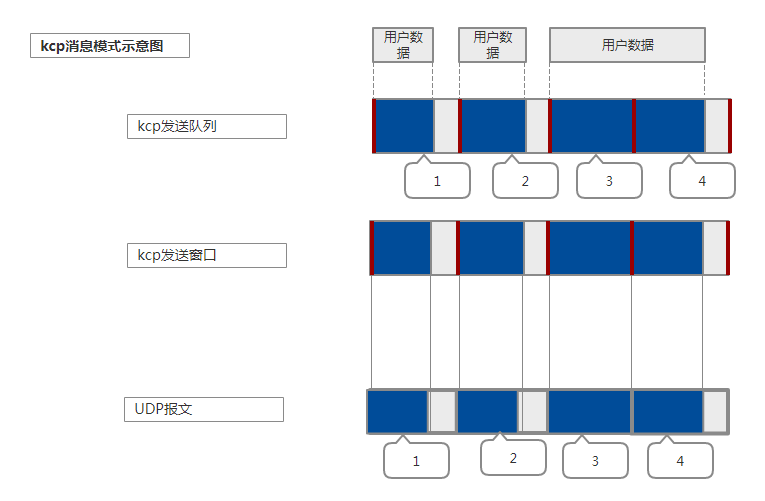

# kcp源码解析

[kcp](https://github.com/skywind3000/kcp)是一个实现了类似tcp的重传、流控、拥塞控制等机制的传输协议，它没有指定传输协议，但是一般情况下都会用udp来传输，
相当于用udp实现的tcp协议。它在不稳定的网络环境中采用更激进的方法来获得比tcp更快的传输速度，代价就是会消耗更多的流量。
跟tcp一样，kcp采用滑动窗口机制来实现流控，通过重传机制保证了可靠性，通过慢启动，拥塞避免，快速重传和快速恢复来实现拥塞控制。

kcp支持两种模式：流模式和消息模式。

流模式具有更高网络利用率，更大的传输速度，但是解析数据相对更复杂。

消息模式具有更小的网络利用率，更小的传输速度，但解析数据更简单。

## 相关变量

| 字段       | 含义              | 注释                                                                                     |
|------------|-------------------|------------------------------------------------------------------------------------------|
| rcv_wnd    | receive window    | 接收窗口大小                                                                             |
| rmt_wnd    | remote window     | 远端可接收窗口                                                                           |
| snd_wnd    | send window       | 发送窗口大小                                                                             |
| cwnd       | congestion window | 拥塞窗口大小                                                                             |
| rcv_buf    | receive buffer    | 接收缓冲区，缓冲底层接收的数据，组装连续以后拷贝到接收队列                               |
| rcv_queue  | receive queue     | 接收队列，接收的连续数据包，上层应用可以直接使用，不能超过接收窗口大小                   |
| snd_queue  | send queue        | 发送队列，上层应用数据分片后加入发送队列                                                 |
| snd_buf    | send buffer       | 发送缓冲区，已发送尚未确认的包                                                           |
| buffer     |                   | 调用output发送的数据                                                                     |
| probe      |                   | ICKP_CMD_WASK  IKCP_CMD_WINS                                                             |
| acklist    | sn,ts             | 待发送的ack列表                                                                          |
| fastresend |                   | 快速重传门限，无须等待超时，如果n没收到ack但是收到了n+1,n+2,...n+fastresend那么立即重传n |
| ssthresh   | slow start thresh | 拥塞窗口阈值                                                                             |
| incr       |                   | 可发送的最大数据量                                                                       |
| stream     | stream mode       | 是否使用流模式                                                                           |

## RTO计算（Retransmission timeout）

kcp的重传超时计算方法参考了tcp的实现[Computing TCP's Retransmission Timer](https://tools.ietf.org/rfc/rfc6298.txt)，不过在参数设置上更加激进。
计算过程主要维护两个变量：

* SRTT: smoothed round-trip time
* RTTVAR: round-trip time variation

接收端收到确认包以后根据rtt更新这两个变量，并重新计算rto值。报文超时以后tcp的rto会翻倍，
kcp中声称采用的是1.5倍，然而代码中实际上是线性增加，不知道是作者有意为之还是实现bug。

## Segment头部

| 含义   | 会话id          | 包类型  | 是否分片 | 发送端接收窗口 | 时间戳    | 包序列号       | 未确认包序号  | 数据长度 | 数据 |
|--------|-----------------|---------|----------|----------------|-----------|----------------|---------------|----------|------|
| 字节数 | 4               | 1       | 1        | 2              | 4         | 4              | 4             | 4        | len  |
| 字段名 | conv            | cmd     | frg      | wnd            | ts        | sn             | una           | len      | data |
| 全名   | conversation id | command | fragment | window         | timestamp | segment number | unacknowledge | length   | data |

报文字段含义：

| 字段名   | 含义                                                        |
|----------|-------------------------------------------------------------|
| conv     | 通信双方需要保证相同的会话id                                |
| cmd      | ICKP_CMD_PUSH/IKCP_CMD_ACK/IKCP_CMD_WASK/ICKP_CMD_WINS      |
| wnd      | 剩余接收窗口大小（接收窗口大小 - 接收队列大小）             |
| ts       | message发送时刻的时间戳                                     |
| sn       | 分片segment序号                                             |
| una      | 待接收消息序号（接收滑动窗口左端）                          |
| frg      | 分片ID，从大到小，0表示最后一个分片                         |
| fastack  | 收到ack时计算的该分片被跳过的累积次数                       |
| xmit     | 分片发送的次数，每发送一次加1,超出dead_link，说明目标不可达 |
| resendts | 下一次超时重传的时间戳                                      |
| rto      | 该分片的超时重传等待时间                                    |
| len      | 数据长度                                                    |
| data     | 数据                                                        |

## `int ickp_input(ikcpcb *kcp, const char *data, long size)`
底层收包后调用，再由上层通过recv获得处理后的数据。
循环从data中取出kcp包。直到剩下的长度小于包头长度退出循环.

拆包流程：
* 长度小于包头长度24，退出循环。
* 构造包头，分别检查会话id，数据长度，包体类型。
* 设置远程剩余接收窗口大小。
* 将对方已经确认收到的包从发送缓存snd_buf中删除，相当于发送窗口右移。
* 计算本地真实snd_una，也就是下一个等待确认的发送包。
    * 如果还有未确认的包，为发送窗口左端包序列号
    * 如果没有未确认包，即发送窗口为空，则为下一个发送包snd_nxt
* 根据包的不同类型分别处理
    * ACK包：
        * 计算rtt，更新rto，更新算法参考rfc6298
        * 从发送窗口中删除对应的包，并更新此包之前未确认包的fastack信息
    * PUSH数据包：
        * 判断收到的包的sn是不是位于区间：[rcv_nxt, rcv_nxt+rcv_wnd), 是则继续，否则丢弃
        * 在接收窗口内，将其加入acklist，下一次flush的时候确认
        * 构造一个kcp包，判断是否重复，如果不是重复包，插入接收缓存rcv_buf中对应位置
        * 将rcv_buf中的已经收到的连续包移到接收队列rcv_queue中，供上层应用读取，并从rcv_buf中移除
    * WASK包：
        * 设置probe的TELL标记，flush的时候推送
    * WINS包：
        * 无须处理，因为之前已经设置了对方的剩余接收窗口大小

所有包处理完毕以后，根据对方确认包的信息，更新拥塞窗口大小。
* 如果拥塞窗口小于对方剩余接收窗口，则需要更新
* 如果拥塞窗口尚未达到ssthresh（慢启动门限），cwnd++
* 如果大于ssthresh,

## `int ikcp_recv(ikcpcb *kcp, char *buffer, int len)`
* 将接收队列中的消息传递给上层应用，因为消息会被拆分成kcp包，所以消息长度需小于接收队列长度*报文长度。
* 将接收缓冲中的连续报文拷贝到接收队列。
* 如果接收队列从满到不满，推送窗口通知消息给发送端，通知有接收窗口，可以继续发送新的报文。

## `int ikcp_peeksize(const ikcpcb *kcp)`

检查接收队列中是否有一个完整的消息，并返回消息的长度。

## `int ickp_send(ikcpcb *kcp, const char *buffer, int len)`
发送应用层的数据，会根据mtu大小分片，每个分片加上segment头部24字节，加入发送队列snd_queue。

根据stream字段区分流模式和消息模式。不同模式组包的机制不一样。如果是消息模式，分片数据的frg字段从count-1到0,0表示分片结束。

## `void ikcp_flush(ikcp *kcp)`
实际发送数据的接口。

* 发送acklist中的ack消息
* 如果对方接收窗口为0，需要发送IKCP_CMD_WASK消息，检查probe对方接收窗口是否ready
* 发送自己的接收窗口大小
* 发送数据

## 参考文献
* [TCP Congestion Control](https://tools.ietf.org/html/rfc5681)
* [Known TCP Implementation Problems](https://tools.ietf.org/html/rfc2525)
* https://github.com/skywind3000/kcp/wiki/Flow-Control-for-Users
* [kcp结构体字段含义](http://www.cnblogs.com/yuanyifei1/p/6830352.html)
